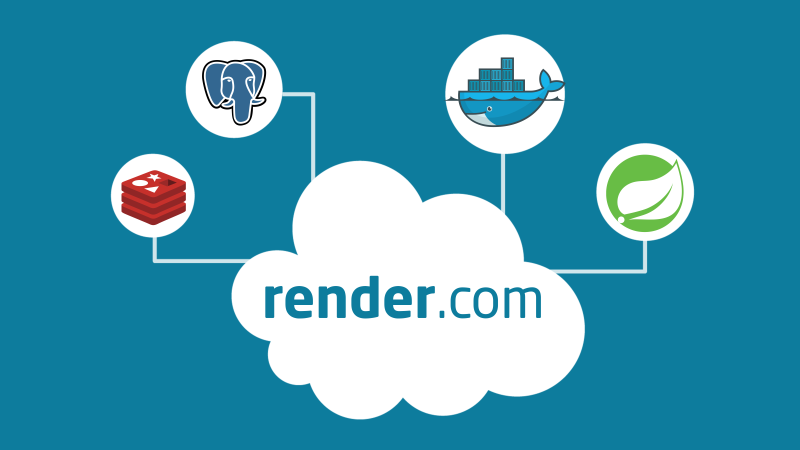

## Deploying Spring boot + Postgres + Redis on Render.com

*render.yaml* in the root of project defines resource we want to provision on render.com and their connection

Youtube tutorial: Host apps on Render.com

